# Workflow FSM (three coupled machines)

The Lattice delivery workflow, formalized as three coupled state machines: **M1 planning** (day, attended), **M2 execution** (night, per ticket, unattended), **M3 knowledge** (slow variable).
Sources: `spc-42` · `ADR-004` · `rev-20260826-141124Z` (Finding 7). Day-side recipe: [day-phase.md](./day-phase.md).

---

## 1. The three machines

| Machine | Scope | Cadence | States |
| --- | --- | --- | --- |
| **M1 planning** | one feature | day, attended | requirement → dialogue → proposal rev → sign-off → Spec locked → ADR (conditional) → tickets → Spec `done` |
| **M2 execution** | one ticket | night, unattended | `queued` → `in-progress` → `pr-open` (+ side states `parked` / `stuck` / `rework` / `deferred`; terminal `closed`) |
| **M3 knowledge** | one decision | slow | journal entry → ratified ×2 → promotion proposal → preferences entry → superseded-with-date |

They couple at the edges: M1 emits tickets into M2's queue; M2 emits decisions into M3's journal and can send scope escapes back to M1 (Spec revision); M3 feeds resolved preferences back into M2's decision policy.

### M1 — planning

```text
business requirement (PM)
   → architecture dialogue (evidence-first rounds)
   → solution-proposal rev (2–3 options + recommendation)
   → human macro sign-off (multiple choice)
   → Spec locked (create-spec)
   → ADR when cross-feature (create-adr)
   → tickets (create-tickets: anticipated-decisions scan + ## Approach)
   → Spec done (finish-work stamps when workstream complete; all child tickets closed)
```

Spec revision = supersede with a new `spc-N` (never silent rewrite of id, per `create-spec`); the old Spec's ticket/binders become obsolete — finish-work's land-time Spec drift catches deviations. Spec status enum: `draft | locked | done | superseded`.

### M2 — execution (per ticket)

```mermaid
stateDiagram-v2
    state "in-progress" as ip
    state "pr-open" as pr
    [*] --> queued
    queued --> ip: spawn / bind
    queued --> deferred: fuse-halt stamps at trip time (ADR-004 amd tkt-136)
    deferred --> queued: re-schedule
    ip --> pr: PR opened
    ip --> parked: park & pivot (unresolvable decision)
    parked --> queued: ratify (ratify.sh single-commit + re-queue)
    ip --> stuck: fallback bounds hit
    ip --> stuck: watchdog-timeout / abandonment (host stamps at trip time)
    stuck --> queued: unblock
    pr --> rework: findings returned (new brief)
    rework --> ip: fix cycle (fix_cycles ≤2; then ip→pr on push)
    stuck --> [*]: re-scope → M1 (Spec/ticket revision)
    pr --> closed: human merge (day)
    stuck --> closed: cancel
    closed --> [*]
```



Cancel edge: any working state → `closed` (without merge) is a valid cancel edge — the transition table (§2) is authoritative for cancel-from-any-state.

Fuse edge: a batch fuse halt now stamps affected tickets `deferred` + a reason (`fuse-halt`) at trip time (ADR-004 Amendment tkt-136, Option B) so the SoT reflects "not schedulable"; `deferred → queued` remains a human transition (re-schedule into a later batch). Blocked-by-failure dependents likewise stamp `deferred` + reason `blocked-by-failure`. A watchdog-timeout/crash of an already-spawned ticket stamps `stuck` + `wait_reason: unblock` (FSM-2b, tkt-132) — the SoT reflects "needs human investigation," not "active work."

Review path from `pr-open`: chain review (`review-delivery`, artifact-only) → bounded fix cycle (≤2) for material findings → verdict `auto-pass | ratify-then-pass | deep-review` → **human merge**. A materially changed rebase voids the verdict (clean rebase carries it). `stuck` also exits sideways to M1 (re-scope → Spec/ticket revision) — a scope escape is a planning defect, not an execution problem.

### M3 — knowledge

```text
decision journal entry (cites its resolution source)
   → ratified ×2 (morning triage)
   → promotion proposal (in the digest)
   → .lattice/preferences.md entry (INVARIANT / DEFAULT / HINT)
   → superseded with a date (never deleted)

operator-stated preference (mid-session utterance)
   → written to .lattice/preferences.md AT UTTERANCE TIME by the active skill
     (Capture duty, decision-policy.md — provenance `operator-stated`; pr-88)
   → superseded with a date (never deleted)
```

The ×2-promotion path is for journal-derived candidates; an explicit operator directive takes the direct edge — the agent writes it immediately with provenance and confirms in one line. Spec/ADR always outrank preferences.

---

## 2. Transition table

Owner legend: **human** (attention-contract white-list, §3) · **agent** (delegable under policy) · **system** (scripts/orchestrator on durable artifacts).

### M1 planning

| State → State | Trigger | Owner |
| --- | --- | --- |
| — → requirement | PM brings a business requirement | human |
| requirement → proposal rev | evidence pass + 2–3 candidate architectures + recommendation | agent |
| proposal rev → Spec locked | **macro sign-off** (multiple choice) → `create-spec` | human |
| Spec locked → ADR | cross-feature law promoted via `create-adr` | agent |
| Spec → tickets | `create-tickets` split (anticipated-decisions scan, `## Approach`) | agent |
| Spec locked → Spec revised | **Spec revision** (incl. execution-discovered, routed from M2 `stuck`) | human |

### M2 execution

| State → State | Trigger | Owner |
| --- | --- | --- |
| queued → in-progress | batch-work spawn / start-work bind | system |
| queued → deferred | fuse-halt / blocked-by-failure stamps `deferred`+reason at trip time (ADR-004 amd tkt-136 Option B); or deliberate human deschedule | system / human |
| deferred → queued | re-scheduled into a later batch | human |
| in-progress → pr-open | `create-pr` opens the PR | agent |
| in-progress → parked | irreversible / cross-contract decision, unattended → park & pivot | agent |
| in-progress → stuck | fallback bounds hit OR watchdog-timeout/abandonment; Attempts ledger complete + one well-formed question; binder `wait_reason` stamped (`unblock` \| `re-scope`) so morning triage routes the two different dispositions | agent / system |
| parked → queued | **decision ratification** via `ratify.sh` (single-commit: journal entry + status flip in one git commit; crash window narrowed, not eliminated — ADR-004 amd tkt-136 Option A) | human |
| stuck → queued | unblock (answer / env fix) — `wait_reason: unblock` | human |
| stuck → M1 | re-scope: **Spec revision** / ticket revision — `wait_reason: re-scope` | human |
| pr-open → rework | PR returned with findings (findings become the new brief) | system |
| rework → in-progress | re-enters the queue, address-review shape; `fix_cycles` row stamps the round (ADR-004 §5 cap ≤2). The path is `rework → in-progress → (implement fix) → pr-open` — there is no direct `rework → pr-open`; on push, `in-progress → pr-open` fires (the existing transition), and `fix_cycles` increments | system |
| pr-open → pr-open (verdict voided) | materially changed rebase → re-review; clean rebase carries the verdict | system |
| pr-open → closed (merged) | **merge** — day only; `finish-ledger.sh` stamps `mergedAt` | human |
| any → closed (without merge) | **cancel** | human |

### M3 knowledge

| State → State | Trigger | Owner |
| --- | --- | --- |
| decision point → journal entry | self-decision under decision policy, resolution source cited | agent |
| journal entry → ratified | morning **decision ratification** | human |
| ratified ×2 → promotion proposal | digest proposes promotion to preferences | system |
| proposal → preferences entry | human accepts | human |
| operator utterance → preferences entry | **Capture duty** — durable operator-stated preference written at utterance time, provenance `operator-stated` (decision-policy.md, pr-88) | agent |
| preferences entry → superseded | replaced with a dated supersede (never deleted) | human |

---

## 3. Human-owned transitions (attention contract)

A **closed white-list** — everything not on it is delegable under policy (ADR-004 §1):
Morning triage recipe: [morning-triage.md](./morning-triage.md).

1. **Macro sign-off** (proposal rev → Spec)
2. **Decision ratification** (journal / parked wake-up)
3. **Deep-review verdict**
4. **Spec revision**
5. **Cancel**
6. **Merge** (nights never merge — batch marker gate unchanged)

---

## 4. Safety invariants

| Invariant | Detail |
| --- | --- |
| Night states never reach merged | the `.lattice/.batch-work-active` marker gates merge; merge authority is human, day-side |
| Transitions fire only on durable artifacts | binder / Spec / PR / ledger writes — never on chat or transcript state |
| Every decision transition is journaled | each self-decision cites its resolution source in `## Decision journal` |
| Every autonomous loop declares an upper bound | existing bounds: PCA ≤5 rounds · bug-repro ≤2 cycles · review-fix ≤2 cycles · retry ≤2/path and ≤3 paths/ticket |

---

## 5. Where M2 state lives

The binder field-table **`status`** is the single source of truth for M2 state (ADR-004 §6): working states `queued | in-progress | parked | stuck | pr-open | rework | deferred`, terminal `closed` — merged vs closed-without-merge is read from the `## Finish` ledger's `mergedAt`, not from a separate status value. Legacy `open` is accepted as a coarse value during lazy migration (validator warns). State is never inferred from PR, marker, or worktree existence alone. `validate-lattice-artifacts.py` enforces this statically per snapshot — unknown status values (`invalid_ticket_status`), terminal status without a Finish ledger (`closed_without_finish`), a merged Finish ledger without terminal status (`finish_without_terminal_status`), and duplicate ticket ids (`duplicate_ticket_id`); it does not replay transition history, so edge legality between two valid snapshots is owned by the skills that perform the transitions (amended 2026-08-27, tkt-90 — the earlier "rejects illegal transitions" claim overstated the check).

**Trip-time stamping (amended 2026-08-27, tkt-132/137, ADR-004 amd tkt-136):** fuse-halt and blocked-by-failure now stamp `deferred`+reason at trip time (not "stay `queued`"); watchdog-timeout/abandonment stamps `stuck`+`wait_reason: unblock` (FSM-2b). The binder SoT is honest about schedulability across runs — the ephemeral batch report no longer carries the only failure signal. `parked → queued` ratification is now performed by `ratify.sh` (`_lattice-lib/scripts/`) — single git commit for journal entry + status flip (ADR-004 amd tkt-136 Option A); the earlier "atomically...one write — never" claim is replaced by "single-commit, crash window narrowed, not eliminated."
